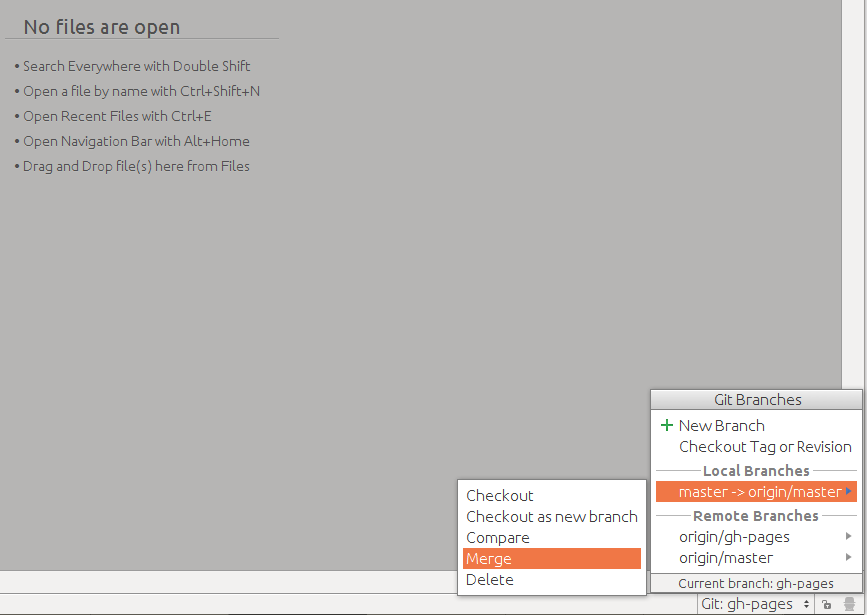
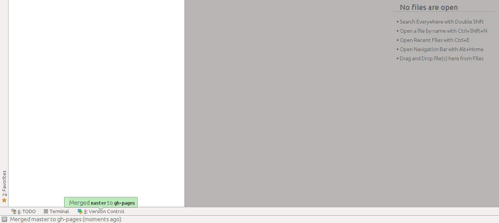
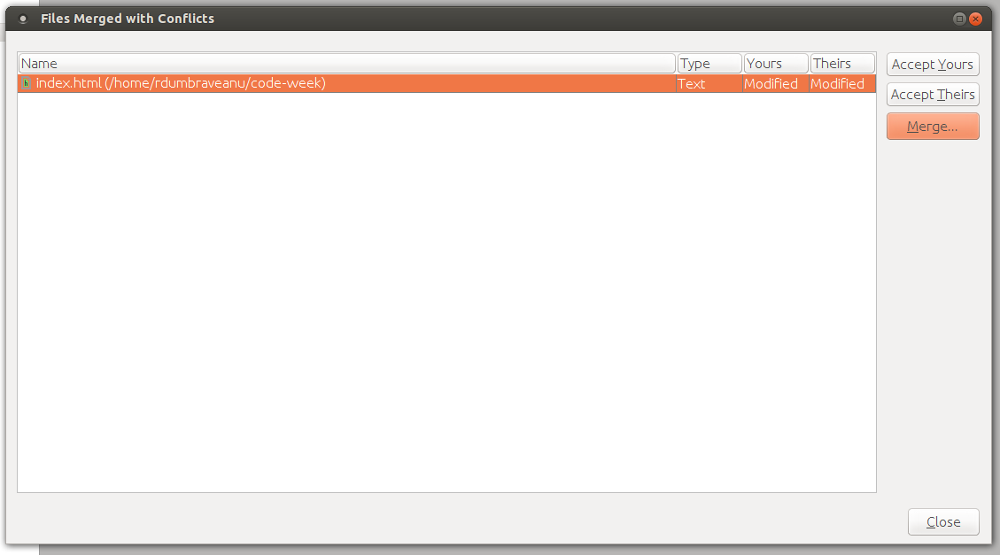

Ramuri
======

.. _idea-cum-să-integrez-o-ramură-în-alta:

Cum să integrez o ramură în alta?
"""""""""""""""""""""""""""""""""

Treceți pe ramura destinație (în care doriți să integrați) de exemplu **gh-pages**

.. image:: ../_static/idea_ramura_curenta.png
    :width: 200px
    :align: center
    :height: 100px

apoi din lista de ramuri faceți clic pe ramura sursă (pe care doriți s-o integrați) de exemplu **master** și meniul contextual alegeți :code:`Merge`

    
dacă nu s-au ivit conflicte de integrare, atunci IDEA vă va înștiința despre finalizare printr-o notificare oranj în partea de jos

în caz că au apărut conflicte de integrare va apărea o ferestră de genul 

în care vor fi presentate toate fișierele în care au apărut conflicte. Pentru a finaliza integrarea va trebui să înlăturați toate conflictele.
